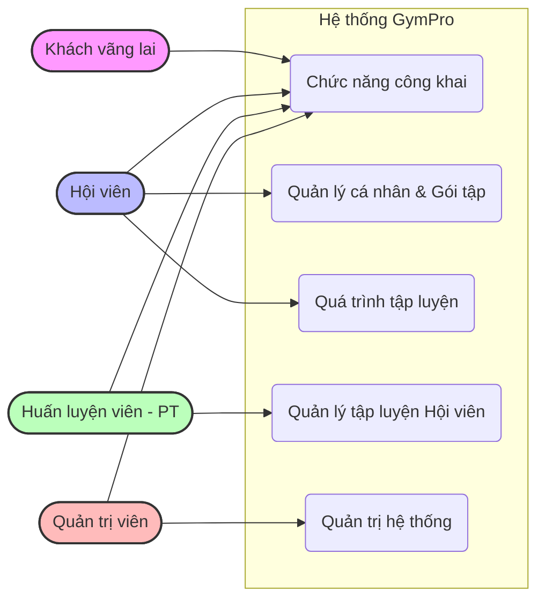
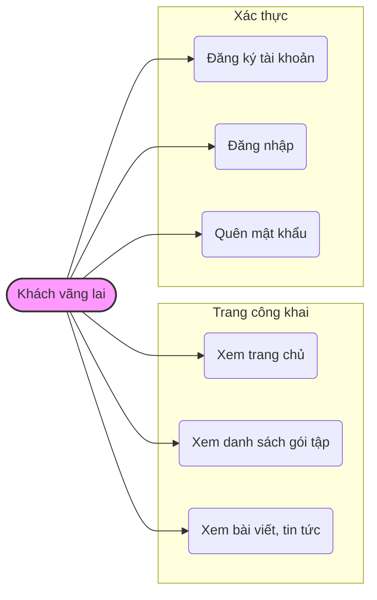
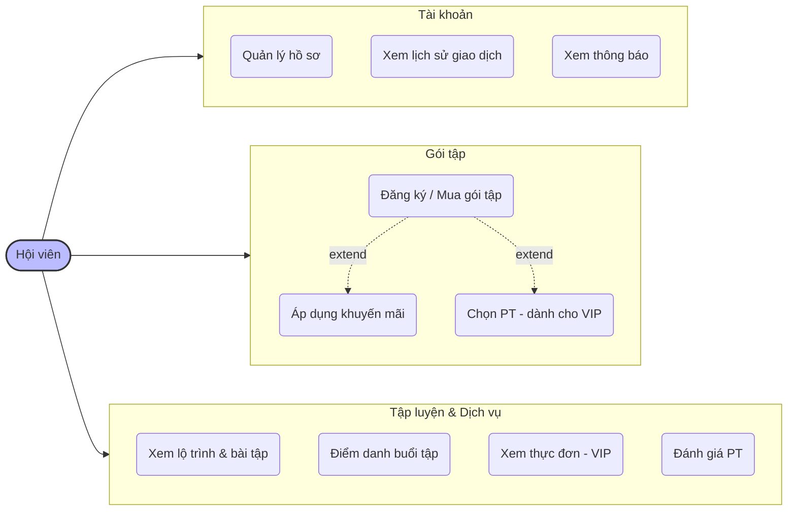
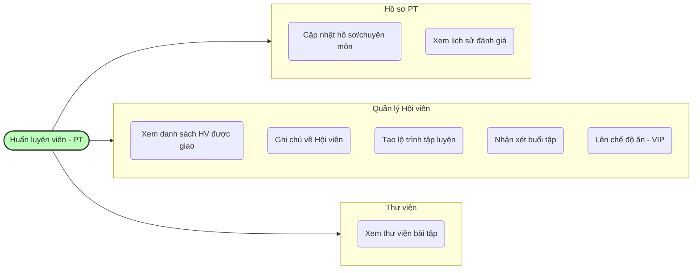
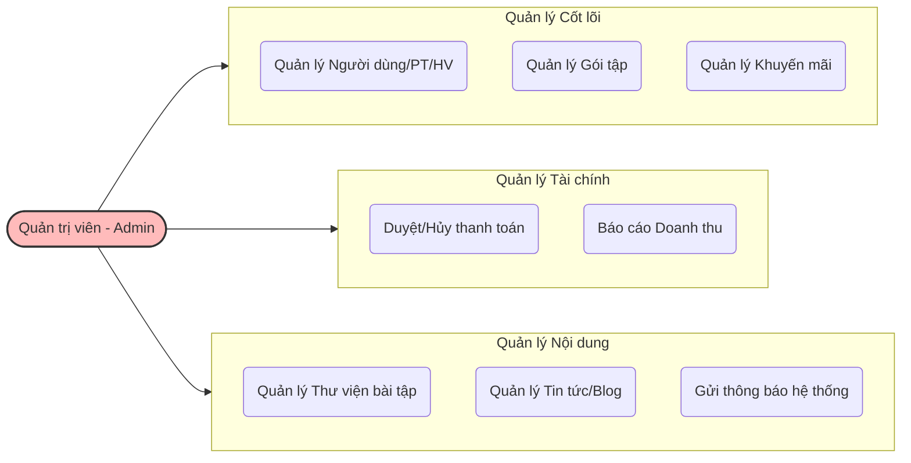

# 🗺️ Sơ đồ Use Case - Hệ thống GymPro

Dưới đây là sơ đồ Use Case tổng quát và các sơ đồ phân rã chi tiết cho từng đối tượng (Actor) dựa trên tài liệu phân tích dự án của bạn.

## 1. Sơ đồ Use Case Tổng quát

Sơ đồ này thể hiện cái nhìn toàn cảnh về hệ thống, bao gồm 4 nhóm người dùng chính và các vùng chức năng cốt lõi của họ.

---

## 2. Sơ đồ phân rã: Khách vãng lai & Xác thực

---

## 3. Sơ đồ phân rã: Hội viên

---

## 4. Sơ đồ phân rã: Huấn luyện viên (PT)

---

## 5. Sơ đồ phân rã: Quản trị viên (Admin)

